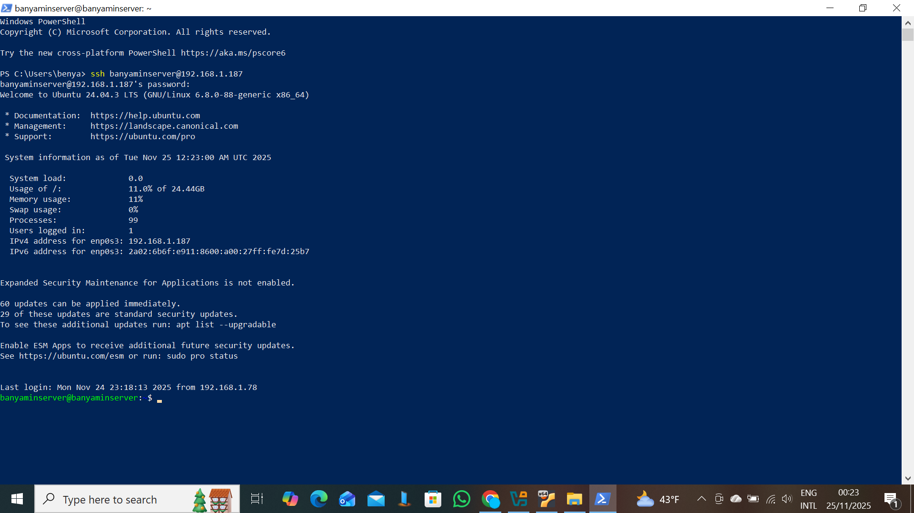
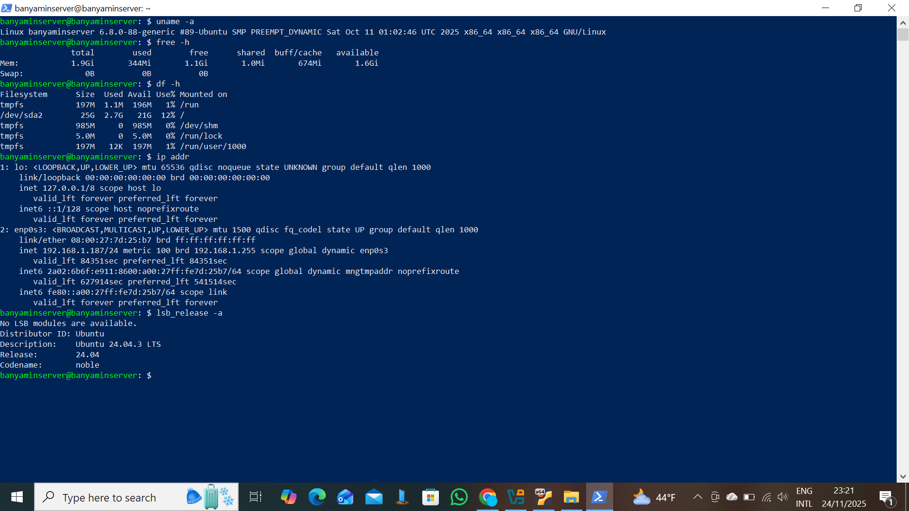

# Week 1: System Planning and Distribution Selection 🛠️

**Phase:** 1 (System Planning and Distribution Selection)
**Focus:** System Architecture, Distribution Choice, and Initial Configuration

---

## 1. System Architecture Diagram 💻 $\rightleftharpoons$ 🖥️

### **Architecture Overview**
This coursework utilizes a **Dual-System Architecture**  deployed on a single physical laptop using the **VirtualBox Type-2 Hypervisor**.This setup is a pedagogical constraint designed to enforce command-line proficiency and develop professional remote administration skills.All server administration is performed exclusively via SSH from the workstation.

| Component | Role in Architecture | IP Address |
| :--- | :--- | :--- |
| **Server System** |Headless Ubuntu Server VM | `192.168.1.187` |
| **Workstation System** | Windows 10 Host (Running SSH client) | `192.168.1.78` |

### **Diagram Placeholder**
*[Insert your detailed System Architecture Diagram here]*

---
## 2. Distribution and Configuration Justification

### **Server Distribution Choice**
I selected **Ubuntu Server 24.04 LTS** (headless).

* **Justification:** Ubuntu LTS provides long-term stability and security support, which is critical for the hardening tasks required later in the module.Its selection complies with the mandate for a headless Linux server distribution.

### **Workstation Configuration Decision**
I chose **Option B: Host Machine with SSH Client** (Windows 10).

**Justification:** This approach is resource-efficient and develops professional remote administration skills by forcing all server management via SSH,mirroring industry-standard dual-system architecture used by cloud hosting providers.

---
## 3. Network Configuration Documentation 🌐

The systems are connected via a **VirtualBox Bridged Adapter** This configuration ensures the Host (`192.168.1.78`) and the Guest (`192.168.1.187`) are on the same local subnet, simplifying remote SSH access.

* **Server IP Address:** `192.168.1.187`
* **Workstation IP Address:** `192.168.1.78`
* **Connection Protocol:** SSH (Port 22, TCP).

**Remote Administration Evidence:*


---
## 4. System Specifications (CLI Evidence)

The following outputs were gathered remotely via the established SSH connection, demonstrating initial command-line proficiency.



`banyaminserver@banyaminserver:~$` is clearly visible*

### **A. Kernel Information (`uname -a`)**
```bash
banyaminserver@banyaminserver:~$ uname -a
Linux banyaminserver 6.8.0-88-generic #89-Ubuntu SMP PREEMPT_DYNAMIC Sat Oct 11 01:02:46 UTC 2025 x86_64 x86_64 x86_64 GNU/Linux
```

> **Analysis:** The output confirms the system is running the **Linux kernel version 6.8.0-88-generic**, which is required for system configuration documentation.

### **B. Memory Usage (`free -h`)**

Bash

    banyaminserver@banyaminserver:~$ free -h
                   total        used        free      shared  buff/cache   available
    Mem:           1.9Gi       344Mi       1.1Gi       1.0Mi       674Mi       1.6Gi
    Swap:             0B          0B          0B

> **Analysis:** The VM is allocated approximately **1.9GiB of total memory**. Low usage demonstrates the resource efficiency benefits of the headless server configuration.


### **C. Disk Usage (`df -h`)**

Bash

    banyaminserver@banyaminserver:~$ df -h
    Filesystem      Size  Used Avail Use% Mounted on
    /dev/sda2        25G  2.7G   21G  12% /

> **Analysis:** The root file system has **25GB allocated**, with only 12% utilization, providing ample space for application installation.

### **D. Network Interface (`ip addr`)**

Bash

    banyaminserver@banyaminserver:~$ ip addr
    # Output Snipped for clarity of IP address
        inet 192.168.1.187/24 metric 100 brd 192.168.1.255 scope global dynamic enp0s3

> **Analysis:** This verifies the server acquired the IP address **192.168.1.187**, validating the network configuration.

### **E. Distribution Info (`lsb_release -a`)**

Bash

    banyaminserver@banyaminserver:~$ lsb_release -a
    No LSB modules are available.
    Distributor ID: Ubuntu
    Description:    Ubuntu 24.04.3 LTS
    Release:        24.04
    Codename:       noble

> **Analysis:** This confirms the system is running **Ubuntu 24.04.3 LTS**.

* * *

## 5\. Learning Reflection 🧠

This week's focus was on system planning and deployment.

-   **Initial Challenge and Resolution:** The primary technical challenge was troubleshooting the initial SSH server installation, which required manually using `sudo apt install openssh-server` and verifying the service status with `systemctl status ssh`.
    
-   **Key Learning:** The importance of verifying and configuring the **Bridged Adapter** proved critical, as it directly enabled the mandatory dual-system architecture by allowing the host and guest to communicate via distinct IP addresses (`192.168.1.78` and `192.168.1.187`). This foundation is crucial for the security and performance phases of the assessment.
