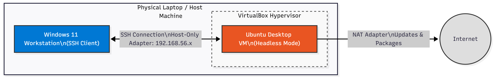

# Week 1: System Planning and Distribution Selection

## 1. Introduction
This week documents the planning of the operating system deployment, the selection of the Linux distribution, and the establishment of the system architecture. The goal is to deploy a functional dual-system environment consisting of a Linux server and an administrative workstation.

## 2. System Architecture Diagram
The diagram below illustrates the dual-system architecture, showing the Windows 11 Workstation connecting to the Ubuntu Server via SSH over a VirtualBox Host-Only network.

## 3. Distribution Selection Justification

### Server System: Ubuntu Desktop (24.04 LTS)
**Decision:** I have selected Ubuntu Desktop (configured for headless operation) hosted as a Virtual Machine.

**Justification:**
1.  **Troubleshooting Safety Net:** As a student new to Linux administration, the risk of lockout via incorrect SSH or firewall configurations is high. The Desktop environment provides a local graphical console that serves as a fail-safe for recovery, allowing me to fix networking errors without rebuilding the entire VM.
2.  **Headless Simulation via Systemd:** To satisfy the assessment requirement for a headless server, I will configure the system to boot into `multi-user.target` (CLI only) by default. This disables the GUI to save resources and demonstrates LO4 (System Configuration) by manually optimizing the run-level.
3.  **Hardware Support:** The Desktop kernel provides robust driver support for virtualization out-of-the-box, allowing me to focus on OS configuration rather than hypervisor troubleshooting.

### Workstation System: Windows 11 (Host)
**Decision:** I have selected Option B, using my native Windows 11 host as the workstation.

**Justification:**
1.  **Resource Efficiency:** Running a separate Linux VM for administration would waste host RAM. Using the native Windows host maximizes resources available to the Server VM for performance testing later in the project.
2.  **Industry Realism:** Administering Linux servers from a Windows endpoint using SSH is a standard professional workflow.
3.  **Tool Availability:** Windows 11 natively supports the OpenSSH client required for the assessment.

## 4. Network Configuration
The VirtualBox network is configured to allow isolation and communication:
* **Adapter 1:** NAT (Allows the Server to access the internet for packages and updates).
* **Adapter 2:** Host-Only Adapter (Creates a private network `192.168.56.x` for SSH access between the Windows Host and the VM).

## 5. System Specifications (CLI Evidence)
The screenshot below documents the system specifications retrieved using the following commands sequentially:
* `uname -a` (Kernel/Architecture)
* `free -h` (Memory)
* `df -h` (Disk Usage)
* `ip addr` (Network Configuration)
* `lsb_release -a` (Distribution Details)

