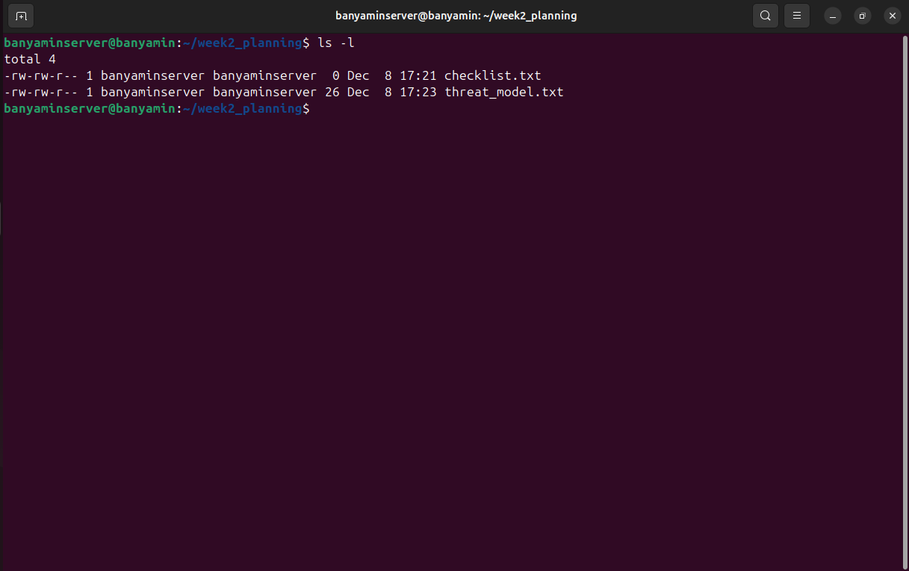

# Week 2: Security Planning and Testing Methodology

## 1. Introduction
This week focuses on designing the security baseline and defining the performance testing methodology. The objective is to establish a structured approach to hardening the system and measuring its behaviour under load before implementation begins.

## 2. Threat Model
I have identified three primary security threats relevant to this server infrastructure and defined mitigation strategies for each.

| Threat ID | Threat Description | Potential Impact | Mitigation Strategy |
| :--- | :--- | :--- | :--- |
| **T01** | **Unauthorized SSH Access** Attackers attempting brute-force login attacks against the SSH service. | Full system compromise; unauthorized data access; installation of malware. | **1.** Disable password authentication. **2.** Enforce SSH Key-based authentication. **3.** Implement Fail2Ban to block repeated failed attempts. |
| **T02** | **Privilege Escalation** A compromised user account gaining root/super-user access. | Loss of system integrity; inability to audit actions; persistent backdoor installation. | **1.** Disable direct root login. **2.** Use `sudo` for administrative tasks. **3.** Implement least-privilege principles for service accounts. |
| **T03** | **Unpatched Vulnerabilities** Exploitation of known security flaws in outdated software packages. | Remote code execution; service denial; data leakage. | **1.** Configure `unattended-upgrades` for automatic security patching. **2.** Regular manual auditing using `lynis`. |

## 3. Security Configuration Checklist
This checklist defines the specific controls that will be implemented in Phase 4 and Phase 5 to secure the server.

### Network & Firewall
- [ ] **Firewall Enabled:** UFW (Uncomplicated Firewall) active.
- [ ] **Default Policy:** Deny all incoming connections by default.
- [ ] **SSH Access:** Allow TCP port 22 only from the Workstation IP (`192.168.56.1`).
- [ ] **ICMP:** Limit or disable ping responses to reduce visibility.

### SSH Hardening
- [ ] **Protocol:** Force Protocol 2.
- [ ] **Root Login:** Set `PermitRootLogin no`.
- [ ] **Authentication:** Set `PasswordAuthentication no`.
- [ ] **Empty Passwords:** Set `PermitEmptyPasswords no`.
- [ ] **Max Tries:** Limit authentication attempts to 3.

### User & Privilege Management
- [ ] **Admin User:** Create a dedicated non-root user for administration.
- [ ] **Sudo Group:** Ensure only the admin user is in the `sudo` group.
- [ ] **Access Control:** Enforce AppArmor/SELinux profiles for exposed services.

### System Maintenance
- [ ] **Updates:** Enable `unattended-upgrades` for security updates.
- [ ] **NTP:** Ensure system time is synchronized for accurate logging.
- [ ] **Banners:** Configure a warning banner for SSH logins.

## 4. Performance Testing Plan
This section outlines how system performance will be measured and analyzed during Week 6.

### Testing Methodology
The testing approach involves two phases:
1.  **Baseline Testing:** Measuring system resources when the server is idle to establish a "control" state.
2.  **Load Testing:** Measuring system resources while the server is running specific applications (defined in Week 3).

### Key Metrics to Monitor
| Metric | CLI Tool | What to Measure |
| :--- | :--- | :--- |
| **CPU Usage** | `top` / `htop` | User vs. System time, Load Average (1, 5, 15 min). |
| **Memory** | `free -m` | Total RAM, Used RAM, Buffer/Cache usage, Swap usage. |
| **Disk I/O** | `iostat` | Read/Write speeds (KB/s), IO Wait time (CPU waiting for disk). |
| **Network** | `iftop` / `nload` | Bandwidth usage (RX/TX), packet loss. |

### Data Collection Strategy
I will create a shell script (`monitor-server.sh`) to automate the collection of these metrics into a log file (CSV format) every 5 seconds during test execution.

## 5. Evidence of Planning (CLI Proficiency)
To demonstrate Week 2 CLI competencies (file manipulation and text editing), I have created text files for the Threat Model and Security Checklist directly on the server.

> *The screenshot below shows the creation of the planning directory and the files using `mkdir`, `touch`, and `ls -l` commands.*

