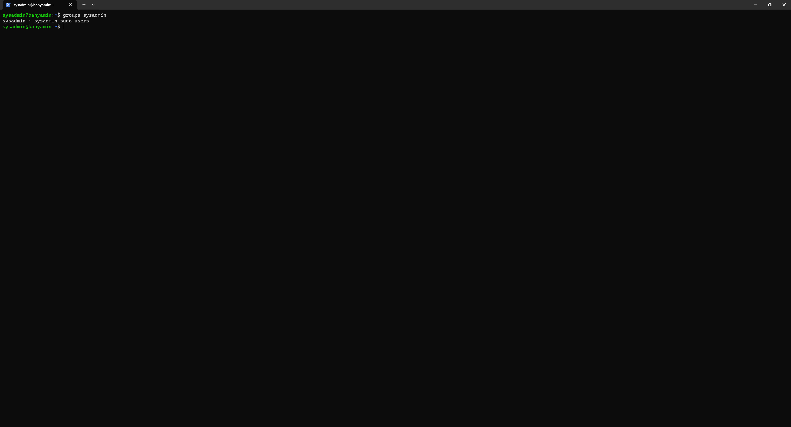
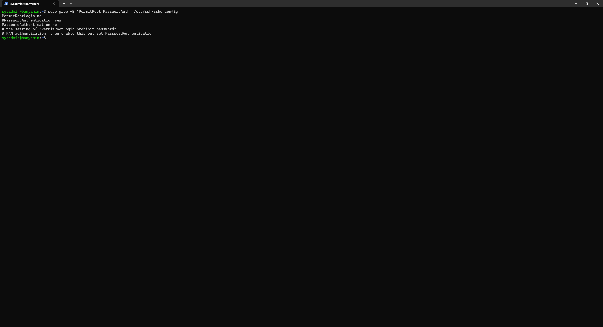
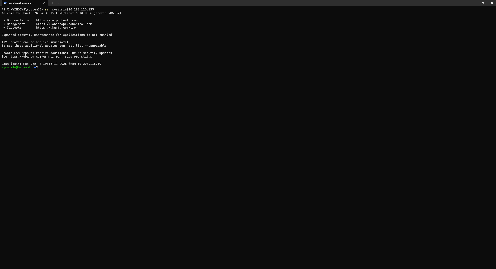
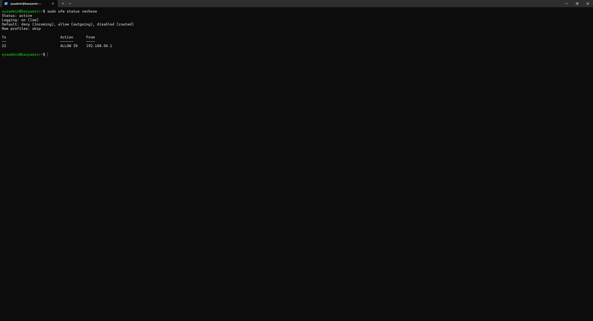

# Week 4: Initial System Configuration & Security Implementation

## 1. Introduction
This week focuses on the practical implementation of the security baseline designed in Week 2. The primary objectives are to establish secure remote access via SSH keys, configure a host-based firewall, and enforce least-privilege user management.

## 2. User & Privilege Management
To adhere to the principle of least privilege, I created a dedicated administrative user (`sysadmin`) to replace the default root/installer account for daily operations.

**Configuration Steps:**
1.  Created the user: `sudo adduser sysadmin`
2.  Granted administrative rights: `sudo usermod -aG sudo sysadmin`
3.  Verified group membership: `groups sysadmin`

> *The screenshot below demonstrates the successful creation of the user and their addition to the sudo group.*

## 3. SSH Security Hardening
I have secured the SSH daemon to prevent unauthorized access and brute-force attacks.

### Implemented Controls:
* **Key-Based Authentication:** Enabled public/private key pairs (Ed25519) for login.
* **Disable Password Auth:** `PasswordAuthentication no` (Prevents brute-force on passwords).
* **Disable Root Login:** `PermitRootLogin no` (Prevents direct attacks on the root account).

### Configuration Evidence
The following `diff` output shows the changes made to the `/etc/ssh/sshd_config` file.

### Access Verification
The screenshot below confirms that I can log in as `sysadmin` from the Windows Workstation using the private key, without being prompted for a password.

## 4. Firewall Configuration (UFW)
I configured the Uncomplicated Firewall (UFW) to create a "Default Deny" policy, allowing traffic only from my specific Workstation IP.

**Ruleset Implemented:**
* **Default Incoming:** Deny (Blocks all unsolicited traffic).
* **Default Outgoing:** Allow (Allows server to fetch updates).
* **Allow SSH (Port 22):** ALLOW FROM `192.168.56.1` (Windows Host-Only Adapter IP).

> *The screenshot below shows the active firewall status and the specific rule permitting only my workstation.*

