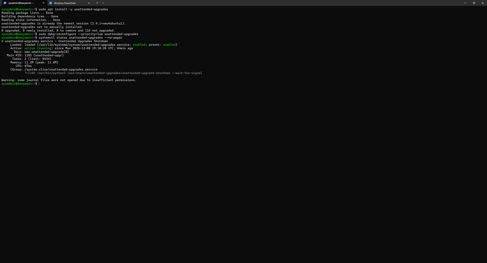
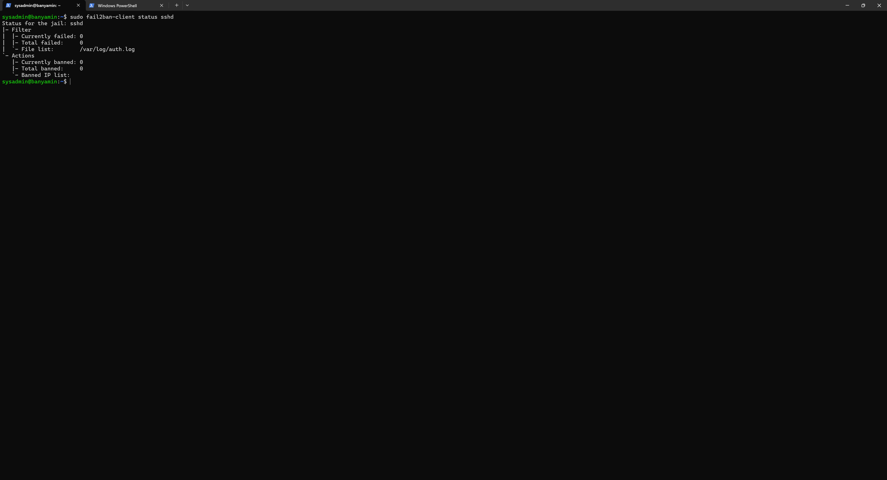
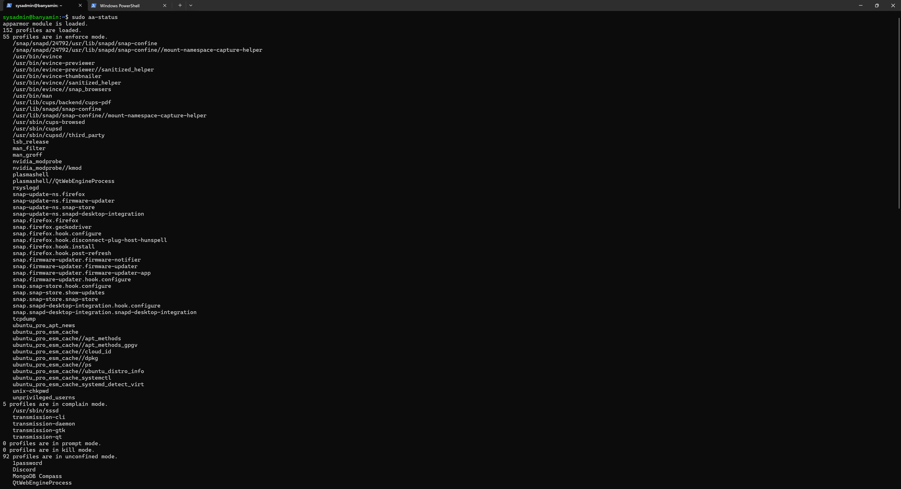

# Week 5: Advanced Security and Monitoring Infrastructure

## 1. Introduction
This week focuses on implementing advanced security controls and automating system monitoring. The goals are to deploy intrusion detection (Fail2Ban), enforce mandatory access control (AppArmor), and create scripts for security verification and remote monitoring.

## 2. Advanced Security Controls

### Automatic Security Updates
I configured `unattended-upgrades` to ensure the server automatically installs security patches without human intervention.
* **Package Installed:** `unattended-upgrades`
* **Configuration:** Enabled automatic reboot for critical kernel updates.

> *The screenshot below shows the active status of the unattended-upgrades service.*

### Intrusion Detection (Fail2Ban)
I deployed Fail2Ban to protect the SSH service from brute-force attacks.
* **Banning Policy:** 5 failed attempts within 10 minutes results in a 24-hour ban.
* **Jail Configuration:** Enabled for `sshd`.

> *The screenshot below shows the active Fail2Ban jail and current ban statistics.*

### Mandatory Access Control (AppArmor)
I verified that AppArmor is active and enforcing security profiles on the system.
* **Current Status:** Enforcing mode.
* **Profiles:** Default Ubuntu profiles are loaded.

> *The screenshot below demonstrates the AppArmor status.*

## 3. Automation Scripts

### Security Baseline Verification Script
I created a shell script (`security-baseline.sh`) that runs on the server to automatically verify that my security configurations (Firewall, SSH, Users) are correct.

> *The screenshot below shows the script execution and the "PASS" results for all checks.*

### Remote Monitoring Script
I developed a script (`monitor-server.ps1`) on my Workstation to remotely connect to the server and retrieve vital performance metrics (CPU, RAM, Disk).

> *The screenshot below shows the script running on Windows and retrieving data from the Linux server.*

