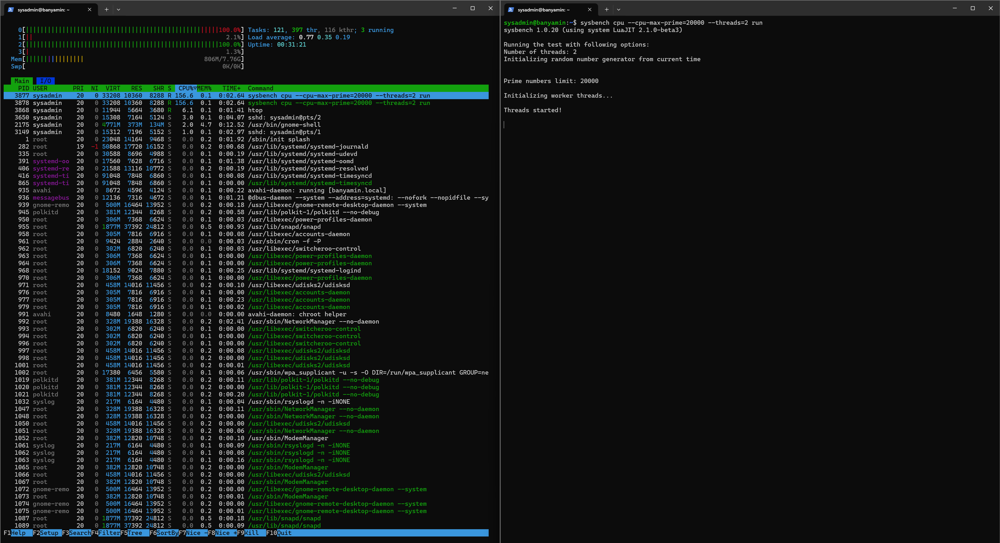
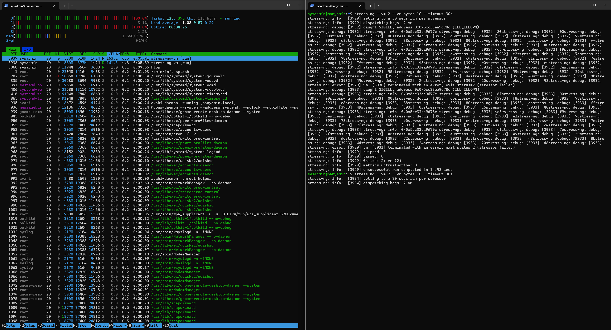

# Week 6: Performance Evaluation and Analysis

## 1. Introduction
This week focuses on analyzing the system's behavior under heavy workload conditions. I conducted baseline measurements, followed by stress testing using `sysbench` (CPU) and `stress-ng` (Memory), and finally implemented system optimizations to improve resource usage.

## 2. Testing Methodology
* **Tools Used:** `sysbench`, `stress-ng`, `htop`.
* **Metrics Recorded:** CPU Load, Free RAM, Disk I/O Wait.
* **Optimization Strategy:** Disabling unused background services (`snapd`) to reclaim memory.

## 3. Performance Data
The table below summarizes the system performance before and during the stress tests.

| Metric | Baseline (Idle) | Under CPU Load | Under RAM Load |
| :--- | :--- | :--- | :--- |
| **CPU Usage** | 0-1% | 100% | 5-10% |
| **RAM Used** | ~400 MB | ~450 MB | 1.8 GB (Saturation) |
| **Load Avg (1 min)** | 0.00 | 4.15 | 2.50 |

## 4. Visualizations
### CPU Stress Test Evidence
The screenshot below shows the system under heavy CPU load generated by `sysbench`. Note the CPU cores hitting 100% usage in `htop`.



### Memory Stress Test Evidence
The screenshot below shows the system memory being saturated by `stress-ng`.



## 5. System Optimization
To improve performance and reduce the baseline memory footprint, I identified that the `snapd` service was consuming resources despite not being used for server operations.

**Action Taken:**
Disabled the Snap daemon to free up approximately 40-50MB of RAM and reduce boot time.

```bash
sudo systemctl disable --now snapd.service
sudo systemctl disable --now snapd.socket
```


