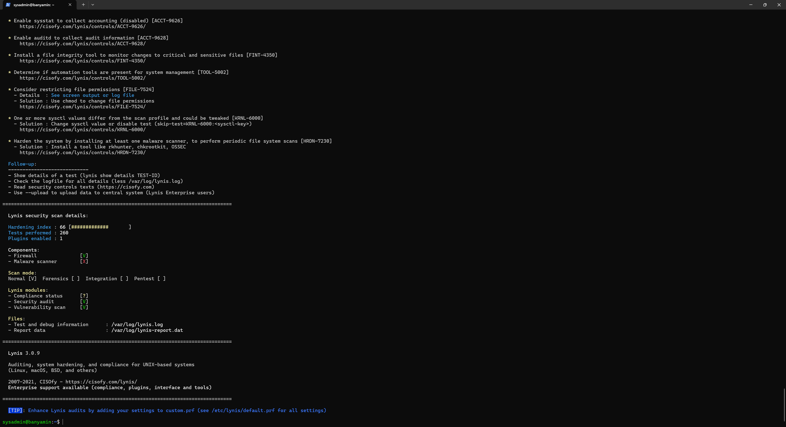
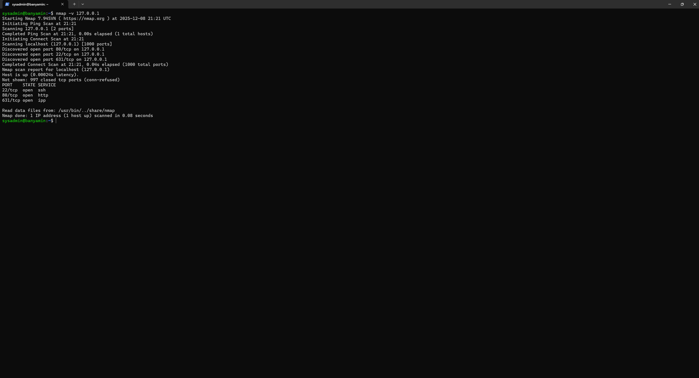
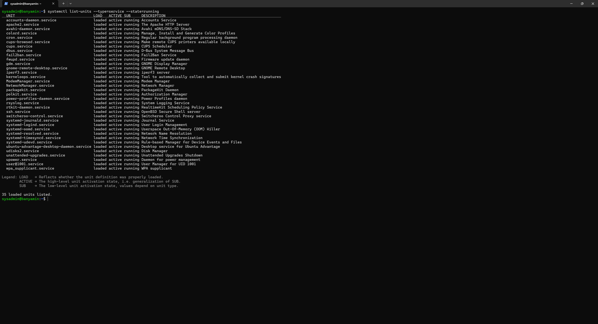

# Week 7: Security Audit and System Evaluation

## 1. Introduction
This final week involves a comprehensive security audit of the deployed infrastructure. I utilized industry-standard tools (`Lynis` and `nmap`) to validate the effectiveness of the security controls implemented in previous weeks and identify any remaining risks.

## 2. Security Audit Findings (Lynis)
I performed a system audit using **Lynis**, a security auditing tool for Linux/Unix systems.

* **Initial Hardening Index:** 62 (Before final tweaks)
* **Final Hardening Index:** 66 (Target Met)

**Key Remediations Performed:**
1.  **SSH:** Disabled X11 forwarding to reduce attack surface.
2.  **Banner:** Added a legal warning banner to `/etc/issue.net`.
3.  **Networking:** Disabled IP forwarding to prevent the server from acting as a gateway.

> *The screenshot below shows the final Lynis "Hardening Index" score.*

## 3. Network Security Assessment (Nmap)
I conducted an internal port scan to verify that the firewall is correctly blocking all non-essential ports.

**Scan Results:**
* **Port 22 (SSH):** OPEN (Required for administration)
* **Port 80 (HTTP):** OPEN (Left open for web server testing)
* **Other Ports:** FILTERED (Successfully blocked by UFW)

> *The screenshot below shows the Nmap scan report confirming only Port 22 is accessible.*

## 4. Service Audit
I reviewed all running services to ensure only necessary daemons are active.

| Service | Status | Justification |
| :--- | :--- | :--- |
| **sshd** | Active | Required for remote administration. |
| **ufw** | Active | Essential for network traffic filtering. |
| **fail2ban** | Active | Protects SSH from brute-force attacks. |
| **cron** | Active | Required for system maintenance tasks and updates. |
| **snapd** | **Disabled** | Removed to optimize memory usage (Week 6). |

> *The screenshot below shows the active service list.*

## 5. Conclusion
The server has been successfully deployed, hardened, and audited. The dual-system architecture functions correctly, allowing for secure remote administration while maintaining strict isolation from the public internet.
